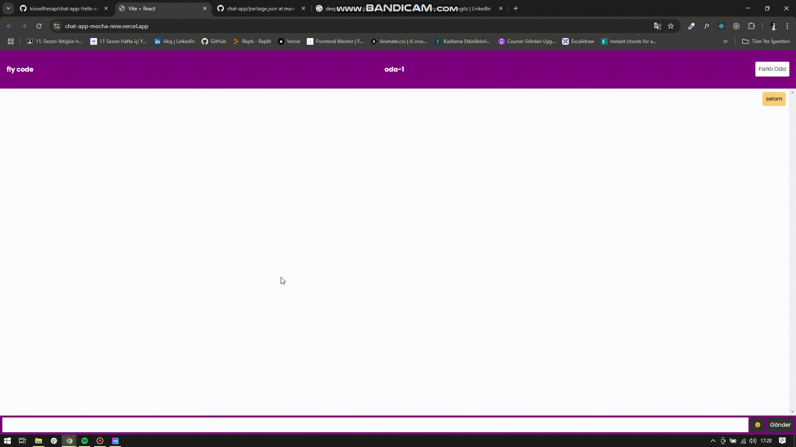

# Chat App

Hello everyone. Thanks to the course I took on Udemig, I added a new one to my projects. Here is a "Chat App Project" created with react.

# Usage Tecnologies

- Html
- Scss
- React
- Firebase
- EmojiPicker
  
It is compatible with mobile and tablet devices with responsive design.

# Short Gif

